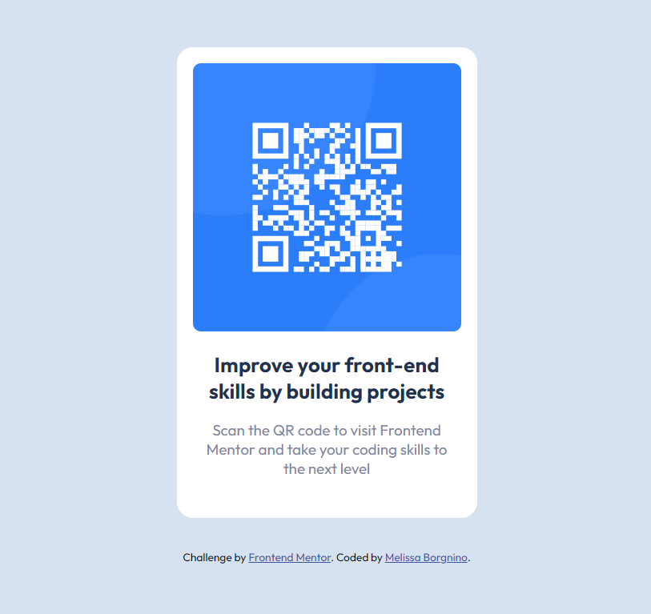

# Frontend Mentor - QR code component solution

This is a solution to the [QR code component challenge on Frontend Mentor](https://www.frontendmentor.io/challenges/qr-code-component-iux_sIO_H). Frontend Mentor challenges help you improve your coding skills by building realistic projects. 

## Table of contents

- [Overview](#overview)
  - [Screenshot](#screenshot)
  - [Links](#links)
- [My process](#my-process)
  - [Built with](#built-with)
  - [What I learned](#what-i-learned)
  - [Useful resources](#useful-resources)
- [Author](#author)


## Overview

The goal was to build a QR Code.

### Screenshot




### Links

- Solution URL: [Solution](https://github.com/melissabo94/qr-code)
- Live Site URL: [Live Site](https://melissabo94.github.io/qr-code/)

## My process

### Built with

- Semantic HTML5 markup
- CSS custom properties
- Flexbox

### What I learned

```css
.proud-of-this-css {
  color: papayawhip;
}

body {
    font-size: 15px;
    font-family: 'Outfit', sans-serif;
    background-color: hsl(212, 45%, 89%);
    display: flex;
    flex-direction: column;
    justify-content: center;
    align-items: center;
    height: calc(100vh - 0.1px);
}

.container {
    display: flex;
    flex-direction: column;
    text-align: center;
    background-color: white;
    padding: 1rem;
    max-width: 300px;
    border-radius: 1rem;;
}
```

### Useful resources

- [A Complete Guide to Flexbox](https://css-tricks.com/snippets/css/a-guide-to-flexbox/) - Great resource to have a clear idea on how flexbox works.


## Author

- LinkedIn - [Melissa Borgnino](https://www.linkedin.com/in/melissa-borgnino-909712198/)
- Frontend Mentor - [@melissabo94](https://www.frontendmentor.io/profile/melissabo94)

